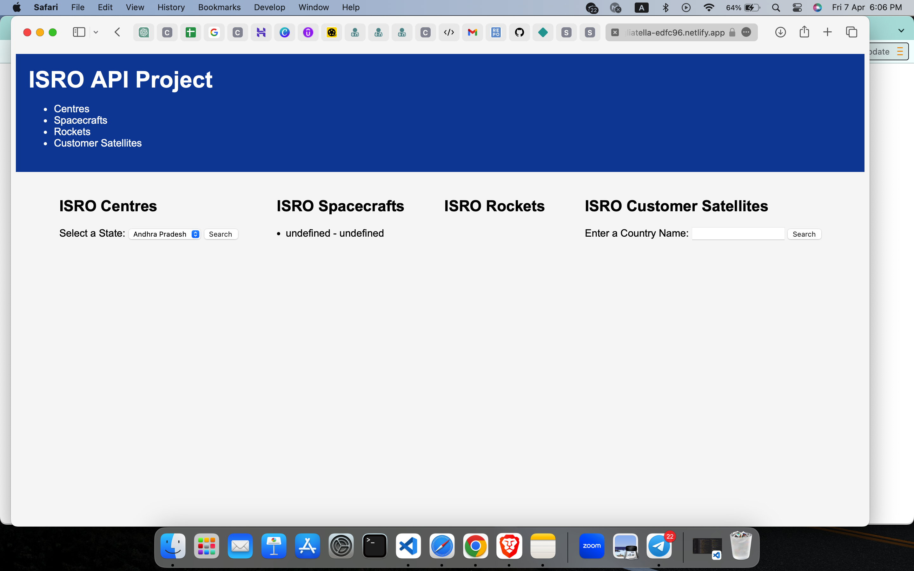

# isroAPI
[Live Link](https://sage-sfogliatella-edfc96.netlify.app)

## Technologies Used
* HTML
* CSS
* JavaScript

Features of the project:
* Using ISRO API to fetch the data of spacecraft rockets and centers data of ISRO and display it. 
* The user should be displayed the centers to which he can search based on the state.
* Users can see the list of spacecrafts created by ISRO. 
* Users can see the list of Rockets created by ISRO. 
* Users can search the customer satellites details based on the country name. 

 ## API Link:
 
   * [Spacecrafts](https://isro.vercel.app/api/spacecrafts)
   * [Launchers](https://isro.vercel.app/api/launchers)
   * [Customer Satellites](https://isro.vercel.app/api/customer_satellites)
   * [Centres](https://isro.vercel.app/api/centres)
 ## Output Results
 
